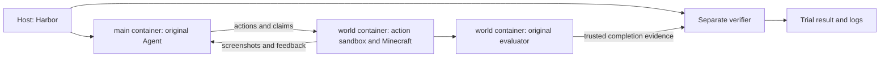

<div align="center">

# MineOdyssey

**Visual navigation and multi-stop instruction following in Minecraft**

[Quickstart](#quickstart) · [Tasks](#tasks) · [Evaluation](#evaluation) · [Harbor](#run-with-harbor) · [Documentation](docs/README.md)

</div>

MineOdyssey evaluates agents that navigate Minecraft worlds from natural-language
instructions. An agent observes the game, uses movement and interaction tools,
visits the required destinations, and submits a completion claim. An independent
evaluator checks actual player positions and task progress.

This source release contains **194 tasks across 30 maps**, with task instructions
in **20 locale variants**. Environments include city streets, parks, palaces,
hotels, stadiums, and ships. Tasks exercise visual grounding, route planning,
vertical navigation, and interaction with doors, stairs, and other world features.

| Included | What it provides |
| --- | --- |
| Task catalog | Local-language instructions, waypoint annotations, map fingerprints, and evaluation settings |
| Reference agent | Image observations, native action tools, asynchronous execution and interruption, request retries, and context summaries |
| Evaluation runtime | Minecraft client/server, position-based completion checks, isolated action execution, and per-run artifacts |
| Linux and Harbor runners | CPU rendering on Linux, plus an optional Harbor deployment that runs the same agent inside a container |

> **Asset availability:** this is a source release. Map archives are supplied
> separately; a public map mirror is not available yet. The quickstart requires
> the exact archive listed in the selected map's manifest. Runtime preparation
> downloads pinned Minecraft and mod dependencies.

## Choose a branch

**You are on `harbor`: the updated base plus the container-local Harbor integration.**

| Branch | Contents | Start here |
| --- | --- | --- |
| [`main`](https://github.com/mine-odyssey/MineOdyssey/tree/main) | Updated reference agent, evaluator, nine waypoint corrections, and Linux runner | [Linux quickstart](#quickstart) |
| [`harbor`](https://github.com/mine-odyssey/MineOdyssey/tree/harbor) | Everything in `main`, plus Harbor task export, lifecycle adapters, and separate verification | [Harbor quickstart](#run-with-harbor) |

The agent, evaluator, task catalog, waypoint data, and runtime controls are identical
between the two branches. Shared fixes belong on `main` first and are then merged
into `harbor`. Harbor-specific code lives in `eval/harbor/`, `eval/harbor_agents/`,
and the Harbor scripts under `scripts/eval/`.

## Quickstart

### 1. Requirements and source

- Linux x86_64 with Python 3 and a working Podman or Docker installation.
- Start with about **16 GB RAM** and **tens of GB of free disk** for one game;
  larger maps and parallel trials need more.
- No GPU or host desktop session is needed. Java 21, the Python application
  environment, Xvfb, and Mesa software rendering are installed inside the image.
- A hash-matched map archive, plus an image-capable model API for agent runs.

The examples below use Podman. Substitute `--engine docker` consistently to use
Docker. The validated Harbor backend is Podman; Docker Harbor trials and ARM64
have not been verified for this release.

```bash
git clone https://github.com/mine-odyssey/MineOdyssey.git
cd MineOdyssey

python3 scripts/launch/navigation-linux.py --engine podman build
python3 scripts/launch/navigation-linux.py --engine podman doctor
```

`doctor` checks Java, software OpenGL, screenshot capture, and the nested action
sandbox. Continue when it reports `"status": "ok"`. The engine must permit the
namespace and mount operations described in the [Linux guide](docs/linux-quickstart.md).

### 2. Prepare the game and one map

Runtime preparation accepts Minecraft's EULA by writing `eula=true`; run it only
if you accept those terms.

```bash
python3 scripts/launch/navigation-linux.py --engine podman prepare-runtime
python3 scripts/launch/navigation-linux.py tasks

python3 scripts/launch/navigation-linux.py --engine podman prepare-map \
  --map innopolis --downloads-dir /path/to/maps
```

For this example, `/path/to/maps` must contain
`navigation-1.21.11-innopolis.zip`. Its SHA-256 must match
[`eval/navigation/maps/innopolis/map.json`](eval/navigation/maps/innopolis/map.json).
Preparation verifies the source and creates a reusable snapshot. Each trial gets
its own world copy; it does not run against the original archive.

### 3. Open a task without model calls

```bash
python3 scripts/launch/navigation-linux.py --engine podman run \
  --task innopolis-006 --vnc
```

Open **http://127.0.0.1:6080/vnc.html** after startup. Review mode starts Minecraft
without calling a model. Press Ctrl+C to stop. On a remote host, forward port 6080
over SSH. Use `--vnc-port 6088` if the default port is occupied.

### 4. Run an agent

Supply an image-capable endpoint that supports Chat Completions and native tool
calls. Credentials are read from the environment and are not placed in command
arguments.

```bash
export MCBOTS_BASE_URL='https://YOUR-PROVIDER/v1'
read -rs -p 'API key: ' MCBOTS_API_KEY
export MCBOTS_API_KEY

python3 scripts/launch/navigation-linux.py --engine podman run \
  --mode pilot --task innopolis-006 --model-id YOUR-MODEL \
  --api-protocol chat_completions --action-protocol tool_calls --vnc

unset MCBOTS_API_KEY
```

`review` starts no agent; `pilot` is for checking a model integration; `formal`
records a formal run and requires a verified runtime. After a successful setup
check, replace `--mode pilot` with `--mode formal` to use that mode. Record the
model parameters as well as the task and runtime version when comparing results.

The reference agent also supports the explicitly selected legacy XML action
protocol and the Responses API. Compatibility depends on the model provider;
see the [Linux guide](docs/linux-quickstart.md) for these options.

## Tasks

The [task catalog](eval/navigation/tasks.json) is the source of truth for this
release. Each entry contains a task ID, map ID, original-language instruction,
ordered waypoint list, and metadata. The first waypoint sets the start; the
remaining waypoints describe the route's required destinations.

**Example: `innopolis-006`**

> Выйдите из дома на «Спортивная улица, 100» и встретьтесь с одногруппником в
> «Win-Win». Вместе идите на занятия в «Университет Иннополис», после них посетите
> тренировку в «Спортивный комплекс «Иннополис»» и завершите день на выставке в
> «ArtSpace».

For readers of this README: leave home at Sportivnaya Street 100, meet a classmate
at Win-Win, attend classes at Innopolis University, train at the sports complex,
and finish at an ArtSpace exhibition. The agent receives the original Russian
task, with the shared English system guidance.

See the [catalog overview](docs/task-catalog.md) for all 30 maps and exact task
counts. Additional map manifests outside the selected roster are retained in the
source tree; they do not increase the benchmark count. The 194-task source roster
must not be confused with a separately selected experimental subset.

## Evaluation

The evaluator samples actual player positions independently of the agent.
Success requires the task's required visits and an **accepted `claim_done`**;
saying that a task is finished does not submit a claim.

| Setting | Current reference profile |
| --- | --- |
| Minecraft | 1.21.11, pinned runtime and mod artifacts |
| Arrival | Within 3.5 blocks in 3D and 1.5 blocks vertically; sampled every second |
| Completion claims | At most 3 attempts |
| Agent budget | 500 successful navigation decisions |
| Infrastructure watchdog | 21,600 seconds (6 hours); watchdog expiry is unscored |
| Asynchronous action timeout | 300 seconds |
| Model requests | 600-second timeout; terminate after 3 consecutive failures; SDK retries disabled |
| Observations | Event-driven screenshots; periodic observations, panorama, and video disabled by default |
| World setup | Adventure mode, peaceful difficulty, fixed noon and clear weather, no flight |

These settings come from the [tracked evaluation profile](eval/navigation/settings/final-navigation-v1.json).
The system prompt's conservative arrival advice is preserved separately from the
evaluator's thresholds. Xaero coordinate displays and waypoint-editing controls
are locked in the runtime; the original player-state API remains available.

Task results distinguish navigation outcomes from infrastructure failures. The
original aggregator reports success rate, checkpoint coverage, duration, traveled
distance, and optional static SPL when a valid reference is present. Missing
references are not treated as zero-length routes. Infrastructure errors are
reported separately from scored failures.

## Results and trajectories

The Linux runner writes results under
`eval/results/navigation/<run-id>/<task-id>/` and working game copies under
`eval/runtime/navigation/`. Key artifacts include:

| Artifact | Purpose |
| --- | --- |
| `run.json` | Task, model, settings, and runtime identity |
| `completion.json` | Success, terminal reason, claims, and infrastructure status |
| `metrics.json` | Route and checkpoint measurements |
| `positions.jsonl` | Sampled player trajectory |
| `agent-result.json` | Agent termination and decision count |
| `messages.jsonl` / `messages.json` | Agent interaction journal and finalized transcript, inside the run's agent record directory |
| `runtime-readback.json`, `snapshot-after-run.json` | Runtime checks and post-run snapshot verification |

For host-side analysis, install Python 3.12+ and
[uv](https://docs.astral.sh/uv/getting-started/installation/), then install the
locked dependencies:

```bash
uv sync --frozen
uv run python scripts/eval/aggregate-navigation-results.py --run-id YOUR-RUN-ID
uv run python scripts/analysis/trajectory_viewer.py --root . --port 8765
```

Aggregation accepts formal results and checks their task, settings, and map
identities. Add `--require-all` when checking a complete benchmark run. The viewer
shows journals and screenshots at `http://localhost:8765`; it binds all interfaces,
so use it on a trusted machine/network. Result artifacts and credentials are
excluded from this source release.

## Run with Harbor

Harbor provides task lifecycle management, container creation, trial scheduling,
log collection, and verifier execution. **The original agent runs inside the
`main` container.** Minecraft and the same evaluator run in `world`; actions still
execute in the original sandbox. A separate verifier reads trusted world results.
The host runs Harbor and the lifecycle adapter.



Install [uv](https://docs.astral.sh/uv/getting-started/installation/) on the host
if needed. Switch branches, build the CPU base image with the same engine, and
export a task:

```bash
git switch harbor
uv tool install 'harbor==0.23.0'
python3 scripts/launch/navigation-linux.py --engine podman build

python3 scripts/eval/export-harbor-navigation.py \
  --task innopolis-006 --output /tmp/mineodyssey-innopolis-006 \
  --map-archive /path/to/maps/navigation-1.21.11-innopolis.zip
```

Create a private JSON file **outside the repository** using this structure, and
replace the placeholder values. The entry name selects a model configuration;
`modelname` is the provider's model ID. The `-m` argument must exactly match
`modelname` (`YOUR-MODEL` below), while `MCBOTS_HARBOR_MODEL_KEY` selects the
configuration entry (`my-model`). Provider-specific parameters belong in
`model_params`.

```json
{
  "my-model": {
    "base_url": "https://YOUR-PROVIDER/v1",
    "api_key": "<YOUR_API_KEY>",
    "modelname": "YOUR-MODEL",
    "api_protocol": "chat_completions",
    "action_protocol": "tool_calls",
    "model_params": {}
  }
}
```

```bash
export MCBOTS_HARBOR_API_MODELS_FILE=/path/to/private/api_models.local.json
export MCBOTS_HARBOR_MODEL_KEY=my-model

python3 scripts/eval/run-harbor-navigation.py --engine podman -- \
  -p /tmp/mineodyssey-innopolis-006 \
  -a eval.harbor_agents.original:OriginalNavigationAgent \
  -m YOUR-MODEL -n 1 --max-retries 0
```

Harbor collects per-trial agent logs and verifier outputs in its job directory.
`--max-retries 0` disables replaying an entire trial; the original agent's bounded
model-request retries remain active. The launcher selects the navigation verifier
so infrastructure failures remain unscored.

The shared agent retains its asynchronous observation and interruption behavior
when changing the model configuration. An arbitrary Harbor agent using the generic
`nav exec` CLI uses a different, synchronous interface and does not automatically
inherit that behavior. See the
[Harbor guide](https://github.com/mine-odyssey/MineOdyssey/blob/harbor/docs/harbor-pilot.md)
for multi-task runs, credential delivery, Podman Compose compatibility, isolation,
and exact validation records.

## Repository layout

```text
agent/                         Reference agent, environment, prompts, and API client
eval/navigation/               Task catalog, map manifests, evaluator, and profiles
containers/                    Linux CPU image and other container definitions
scripts/launch/                Portable Linux launcher
scripts/eval/                  Runtime preparation, task runners, and aggregation
scripts/snapshot/              Map preparation and fingerprint verification
scripts/analysis/              Transcript finalization and trajectory viewer
src/agentbridge/               Java game bridge and runtime restrictions
config/                        Configuration templates
configs/                       Retained evaluation and model parameter examples
tests/                         Unit tests and explicitly invoked live checks
docs/                          Setup, catalog, release, and operational guides
eval/harbor/                   Harbor task template                    [harbor branch]
eval/harbor_agents/            Container bridge and lifecycle adapters [harbor branch]
```

## Development and validation

```bash
uv sync --frozen
uv run python -m unittest \
  tests.test_env_timeout tests.test_summary_feedback \
  tests.test_agent_message_journal tests.test_navigation_snapshots \
  tests.test_wurzburg_waypoint_corrections \
  tests.test_innopolis_harbor_waypoint_corrections
```

The updated base passed 253 Python checks. The latest Harbor container-agent
change passed 59 targeted checks and three real Minecraft integration trials with
a scripted provider, covering asynchronous interruption, retries, isolation, and
unscored failure reporting. These are integration checks, not successful model
navigation results. Historical GLM trials used the earlier host-agent deployment;
a fresh GLM run of the container-agent deployment is not claimed here.

The [release notes](docs/anonymous-release.md) describe the selected fixes,
anonymization, and validation limits. The
[Harbor validation record](https://github.com/mine-odyssey/MineOdyssey/blob/harbor/eval/harbor/innopolis-006/validation.json)
records its version-specific evidence. To report a reproducible issue, include the
branch, task ID, backend, terminal reason, and sanitized logs.

## Acknowledgements and third-party assets

MineOdyssey uses Minecraft, NeoForge, and the mods pinned in the runtime profile.
Map archives and third-party dependencies retain their own terms; the map manifests
do not grant redistribution rights. This source release does not assign a new
license to those assets.

The documentation layout takes inspiration from
[Toolathlon](https://github.com/hkust-nlp/Toolathlon) and
[OSWorld](https://github.com/xlang-ai/OSWorld).
